# Data Connection and Virtualization

This section will cover aspects of collecting data in Cloud Pak for Data. Specifically we will be connecting to different data sources and creating views against those data sources to create a single unified set of data assets that can be used in other modules of this workshop.

The user persona involved is a Data Steward. The data can exist on any database, on premise or on the cloud. Using IBM Data Virtualization we can access the data without moving it, using specifically crafted SQL queries to view the data, join the data and perform other operations. The sequence we will follow will be:

> **Note: To complete this section, an Admin or Data Engineer role needs to be assigned to your user account. The workshop instructor will assign this role as appropriate.**

The section is broken up into the following steps:

1. [Create Virtualized Tables](#create-virtualized-tables)
1. [Create Joined Virtual Views](#create-joined-virtual-views)
1. [Grant Access to Virtualized Data](#grant-access-to-virtualized-data)

## Virtualizing Data

In this section, we will gather data from several tables across data sources. We will use data virtualization to access these tables and then create joined views against those virtualized tables.

### Create Virtualized Tables

* To launch the data virtualization tool, go the (☰) navigation menu and click `Data` -> `Data virtualization`.

* From the Data virtualization sub-menu, Click on the *Menu* drop down list and choose *Virtualization* -> *Virtualize*.

* Several tables names will be displayed across any of the data sources that are included in the data virtualization server. You will notice that on the right panel, we can filter the tables being displayed by selecting the datasource.

* To simplify the search for tables you will use, click on the `Schemas` column header to sort the tables by Schema. Then find the tables we will be using for this workshop: `MEDICATIONS`, `PATIENTS` and `CONDITIONS`, which are under the `CP4DHEALTH` schema. Select the checkboxes next to these three tables, and then click on *`Add to cart`* followed by the *`View Cart`* button.

> *Note: You may need to page through the available tables by clicking on the right arrow at the bottom of the tables view.*

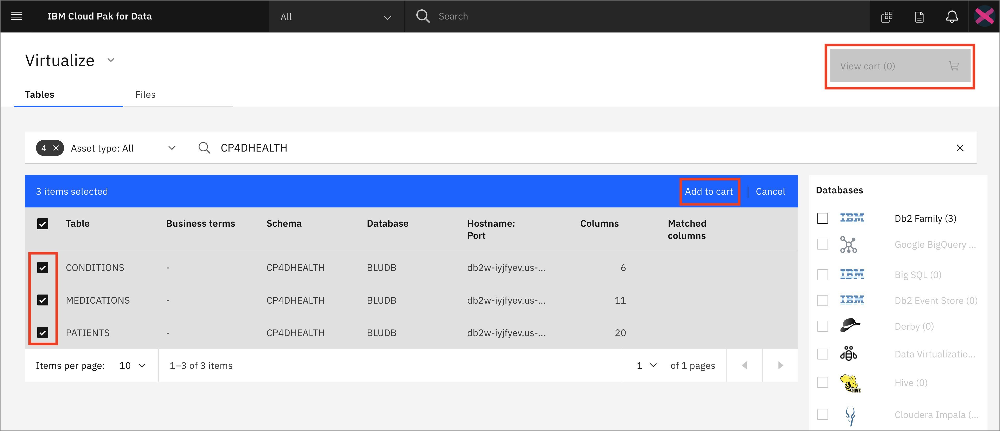

* The next panel prompts you to select where to assign the virtualized tables. Select the `My virtualized data` radio button. Click the *`Virtualize`* button to add the virtualized tables to your data (we left the default values, so the tables will be virtualized under your own user schema with the same table names as the original tables).

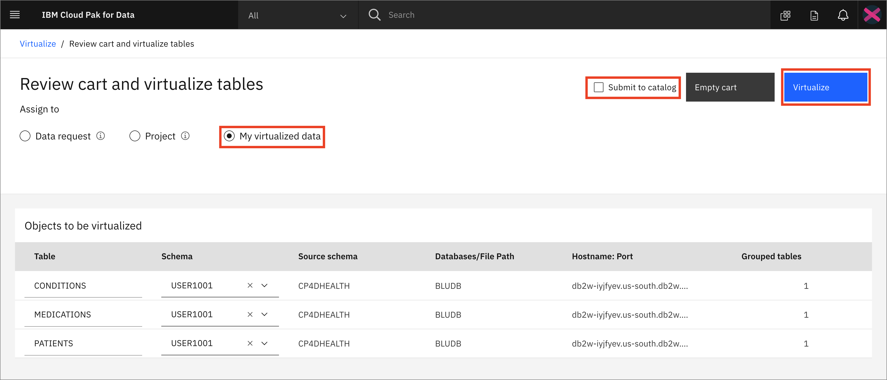

* You'll be notified that the virtual tables have been created. Let's see the new virtualized tables from the Data Virtualization tool by clicking *`View my virtualized data`* button.

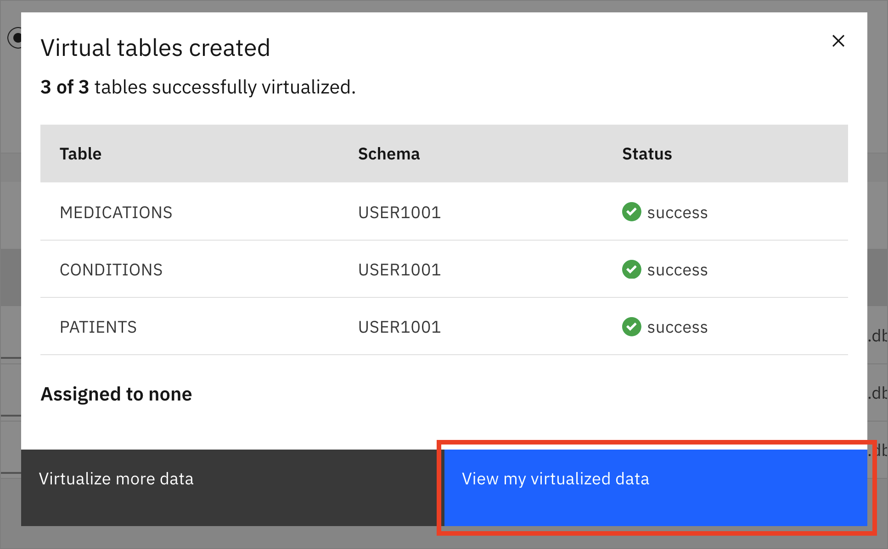

### Create Joined Virtual Views

Now we're going to **join** the tables we previously virtualized, so we have a final merged set of data. It will be easier to do it here rather than in a notebook where we'd have to write code to handle three different data sets.

* From the 'My virtualized data' page, Click on two of the virtualized tables (`PATIENTS` and `MEDICATIONS`) and click the *`Join`* button.

* To join the tables we need to pick a key that is common to both data sets. Here we choose to map `ID` from the *PATIENTS* table to `PATIENT` on the *MEDICATIONS* table. Do this by clicking on one and dragging it to another. When the line is drawn click on the *Next* button.

* In the next panel we will accept the existing names for our columns. Click the *`Next`* button to continue.

* In the next panel we'll give our joined data view a unique name (to be consistent with SQL standards, pick an all uppercase name), choose something like: `XXXPATIENTMEDICATIONS` (where `XXX` is my *All Upper Case* user ID or intitials). Also select the `My virtualized data` radio button. Click the *`Create view`* button to add the virtualized aggregate view to your data.

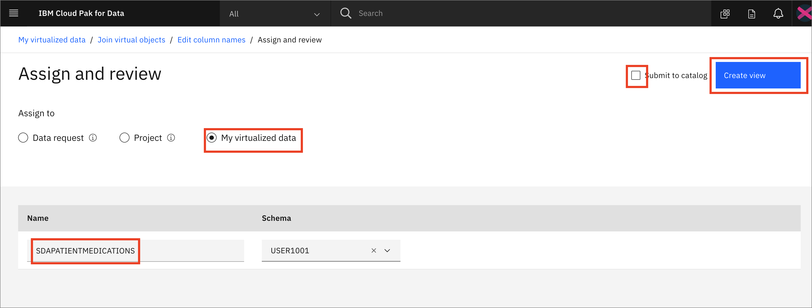

* You'll be notified that the join view creation has succeeded! Click on *View my virutalized data* button.

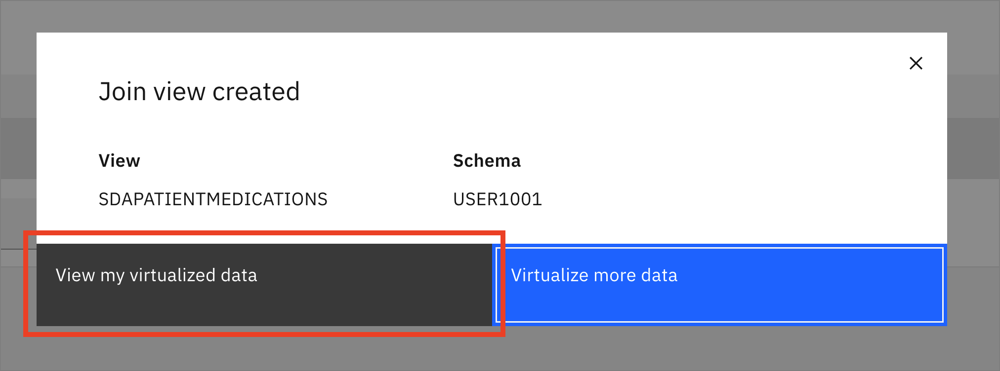

* Repeat the same steps as above, but this time choose to join the new joined view you just created (`XXXPATIENTMEDICATIONS`) and the last virtualized table (`CONDITIONS`), to create a new joined view that has all three tables. Click the *`Join`* button.

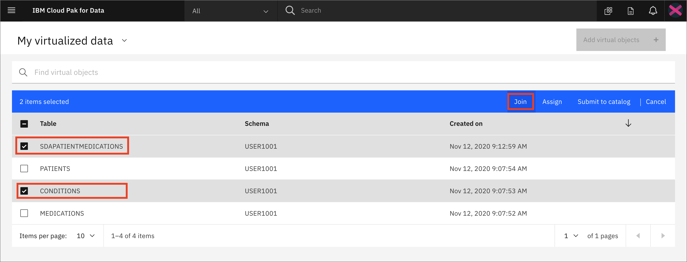

* Again join the two tables by selecting/mapping the `ID` from the *XXXPATIENTMEDICATIONS* table to `PATIENT` on the *CONDITIONS*. Do this by clicking on one and dragging it to another. When the line is drawn click on the *Next* button.

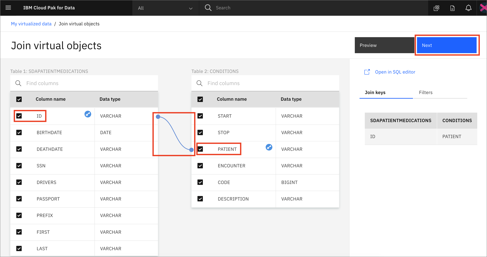

* In the next panel we can scroll to the right and see that there are duplicate columns for *START,STOP,PATIENT,ENCOUNTER,CODE,DESCRIPTION*. Rename them by appending *CONDITION* to each in order to avoid a naming conflict. Click the *`Next`* button to continue.

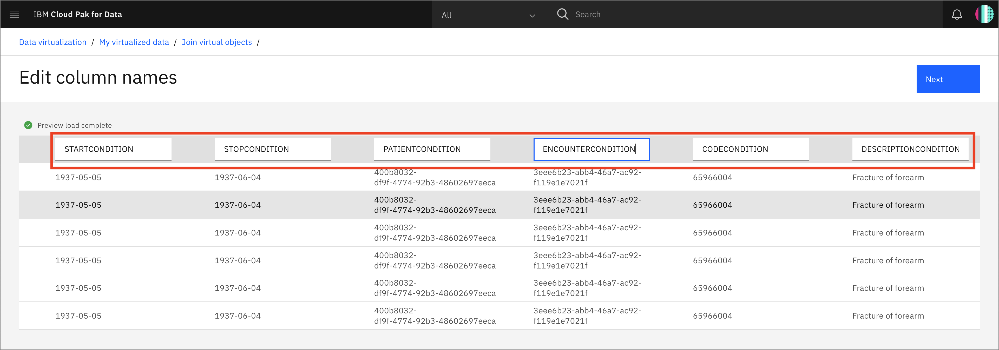

* In the next panel we'll give our joined data view a unique name (to be consistent with SQL standards, pick an all uppercase name), choose something like: `XXXPATIENTMEDICATIONSCONDITIONS` (where `XXX` is my *All Upper Case* user ID or intitials). Also select the `My virtualized data` radio button. If there is a `Submit to catalog` checkbox on the top right, unselect it and finally click the *`Create view`* button to add the virtualized aggregate view to your data.

* You'll be notified that the join view creation has succeeded! Click on *`View my virtualized data`* button.

* From the `My virtualized data` page you should now see all three virtualized tables and two joined tables. 

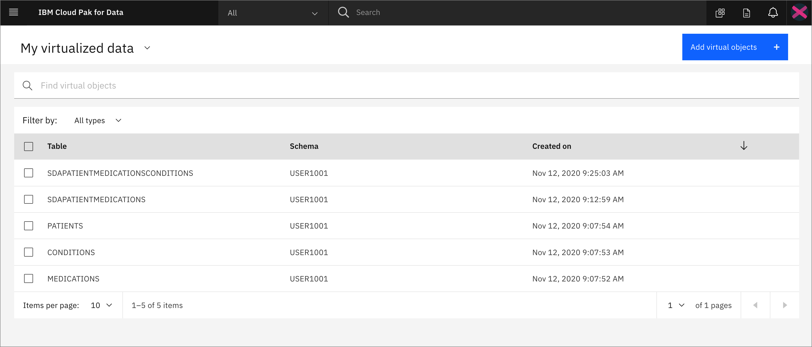

* Next we'll assign our virtual data to our project. Select the `Table` box, or all boxes individually, and click `Assign`.

* For *Assign to* choose `Project`, then select the project that you created in the [pre-work](../pre-work/README.md). Make sure that `Submit to catalog` is unchecked and click `Assign`.

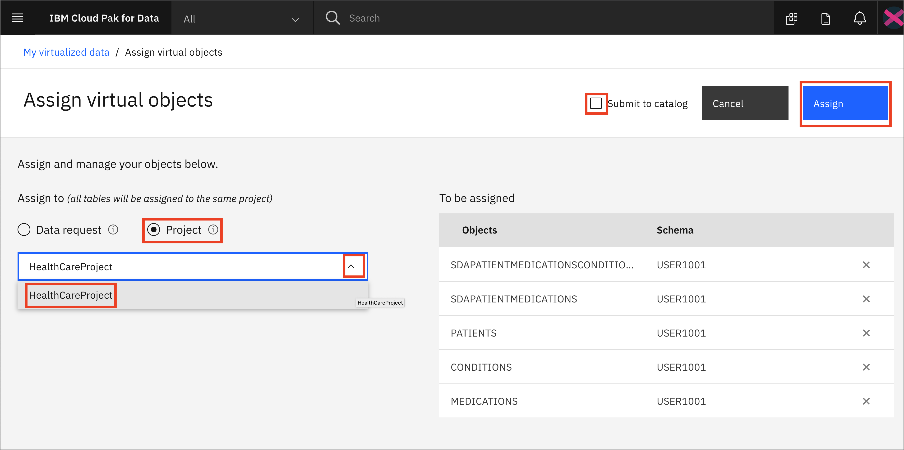

* Go back to your virtualized data if you will complete the next section or finish with the [Conclusion](#conclusion)

## 2. Grant access to virtualized data

>*Note: This section only needs to be completed if there are non-Admin or non-Data Engineer users you are working in a group with. The instructors would have indicated that it needs to be completed to give those users access to the data you have virtualized above.*

In order for other users to have access to the data that you just virtualized, you need to grant them access. Follow these steps to make your Virtualized data visible to them.

* If you are not already in the data virtualization tool, launch the tool by going to the (☰) navigation menu and click `Data` -> `Data virtualization`.

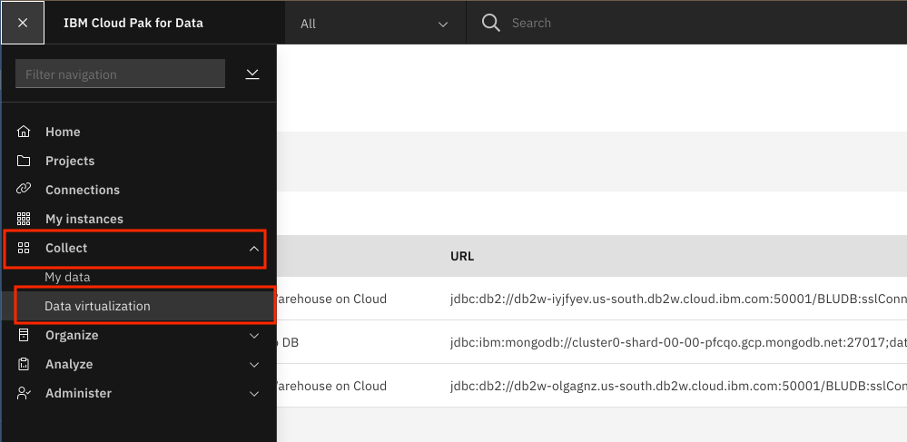

* From the Data virtualization sub-menu, Click on the *Menu* drop down list and choose *Virtualization* -> *`My virtualized data`*.

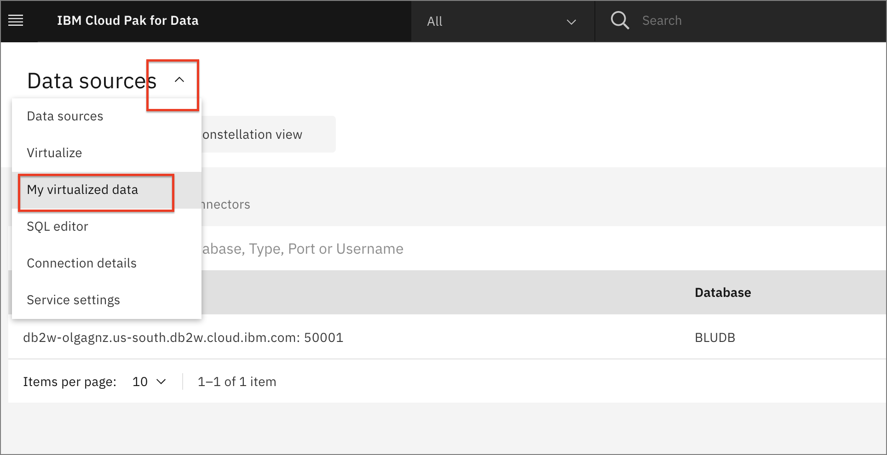

* For one of the virtualized data assets you've created, click the 3 vertical dots on the right (*Note: you will have to hover over the area all the way on the right of the table row to see the dots.*) and choose `Manage access`.

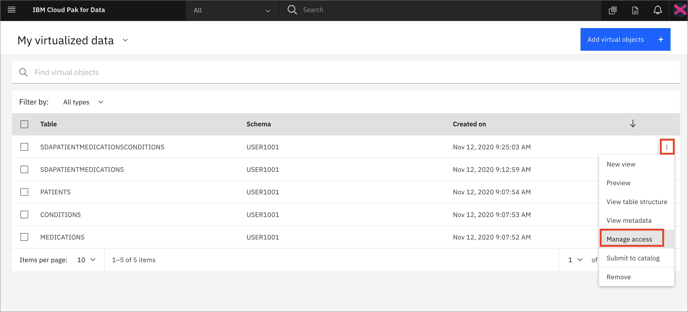

* Click the `Specific users` button and click the `Add user` button.

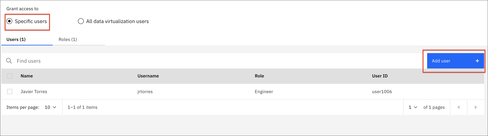

* Select the user (or multiple users) you wish to grant access to and click the `Add users` button.

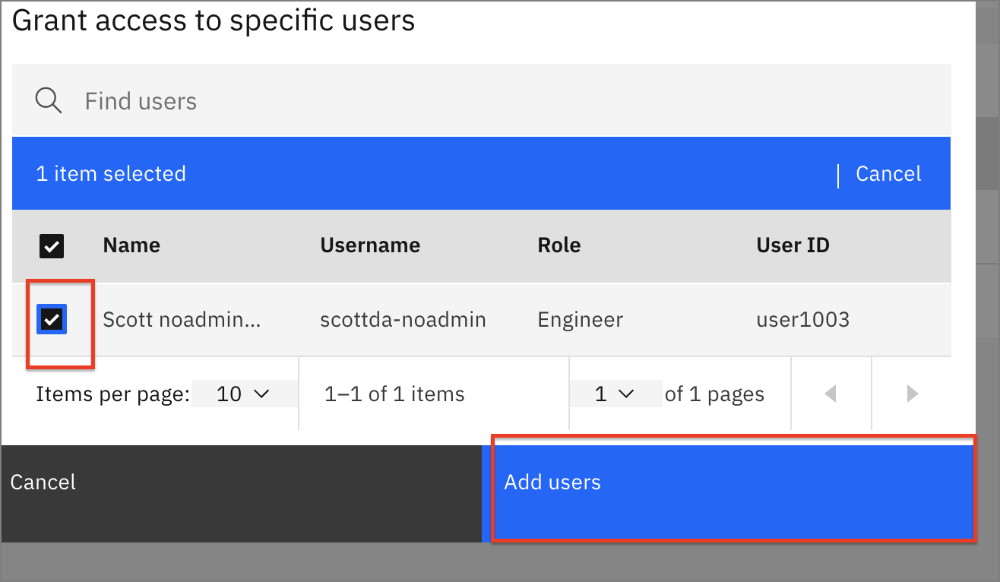

* Repeat the above steps to give access to the remaining virtualized tables and views (all five that you created).

## Conclusion

In this section we learned how to make connection to databases that contain our data, how to virtualize them, and how to allow other to collaborate with us and use the virtualized data.

Remember that you can add data from different databases and servers if you need to. Moreover, you can virtualized these data from different sources together as well! The goal is to take care of bringing the data to the platform early on so all the data scientists can use it without reinventing the wheel while you keep full control of who has access to what data.
