# Data Visualization and Data Refinery

Let's take a quick detour to the *Data Refinery* tool. Data Refinery can quickly filter and mutate data, create quick visualizations, and do other data cleansing tasks from an easy to use user interface.

This section is broken up into the following steps:

1. [Load the data](#1-load-data)
1. [Refine the data](#2-refine-data)
1. [Profile the data](#3-profile-data)
1. [Visualize the data](#4-visualize-data)

>*Note: The lab instructions below assume you have a project already and have data you will refine. If not, follow the instructions in the pre-work and import data to project sections to create a project and assign data to your project.*

## 1. Load Data

* Go the (☰) navigation menu and click on the *Projects* link and then click on your analytics project.


* From the *Project* home, under the *Assets* tab, ensure the *Data assets* section is expanded or click on the arrow to toggle it and open up the list of data assets.

* Click the check box next to the merged data asset  *XXXPATIENTMEDICATIONSCONDITIONS* (where `XXX` is your username or the username of the person who granted you data access) to check it, then click the 3 vertical dots to the right, and select the *Refine* option from the menu.

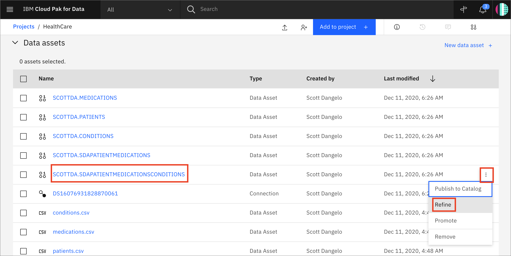

* Data Refinery will launch and open to the `Data` tab. It will also display the information panel with details of the data refinery flow and where the output of the flow will be placed. Go ahead and click the `X` to the right of the *Information* panel to close it.

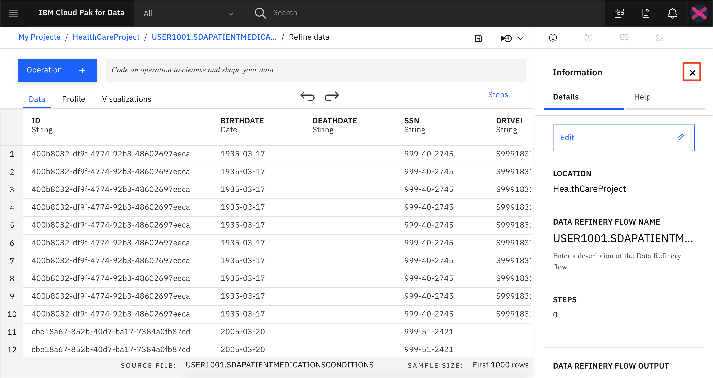

## 2. Refine Data

We'll start out in the *Data* tab where we wrangle, shape and refine our data. As you refine your data, IBM Data Refinery keeps track of the steps in your data flow. You can modify them and even select a step to return to a particular moment in your data’s transformation.

### Create Transformation Flow

* With Data Refinery, we can transform our data by directly entering operations in R-style syntax or interactively by selecting operations from the menu. For example, start typing *filter* on the Command line and observe that autocomplete will give hints on the syntax and how to use the command.

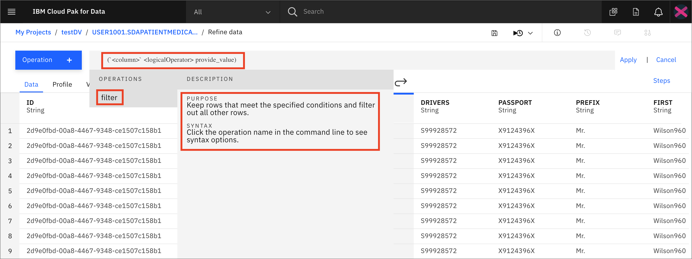

* A `filter` operation syntax will be displayed in the Command line. Clicking on the operation name within the Command line will give hints on the syntax and how to use the command. For instance the following command filters for Patients who live in `Lancaster`:
  ``` R
  filter(`CITY` == 'Lancaster')
  ```

* Type or cut-n-paste the filter above in the command line and click `Apply`. Notice that the remaining rows have the City 'Lancaster'.

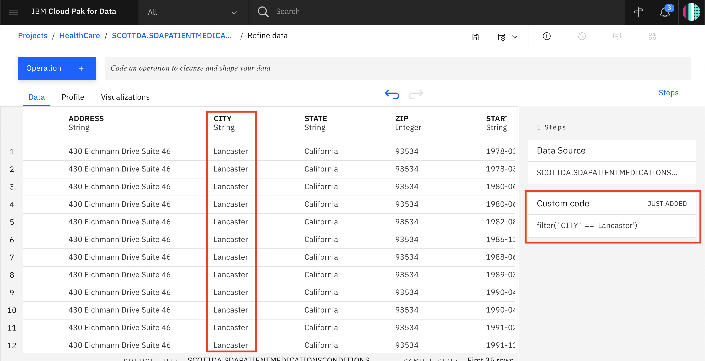

* Now, click on the counter-clockwise "back" arrow to remove the filter. Alternately, we can also remove the filter by clicking the trash icon for the Filter step in the *Steps* panel on the right.

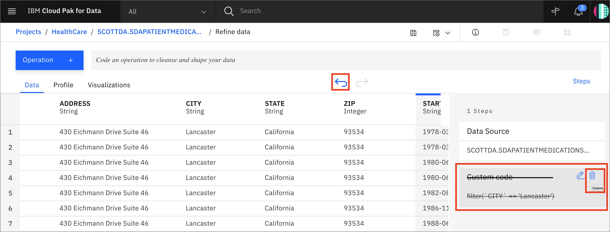

* We will use the UI to explore and transform the data. Click the `+Operation` button.

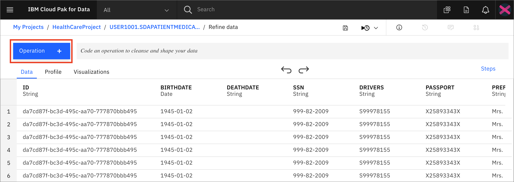

* Let's use the `Filter` operation to check some values. Click on `Filter` in the left panel.


* Let's look at all the Patients who are no longer alive. Select the *`DEATHDATE`* column from the *Column* drop down list, and select *`Is not empty`* from the *Operator* drop down list, and then click the `Apply` button.


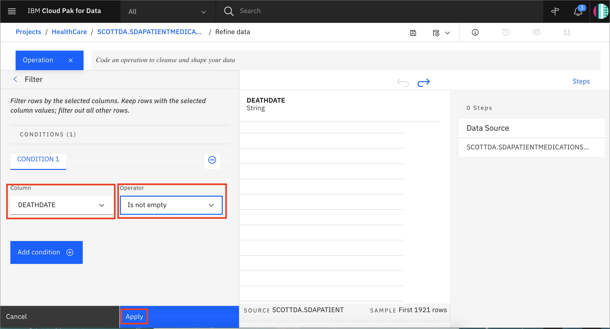

* Now, click on the counter-clockwise "back" arrow to remove the filter. Alternately, we can also remove the filter by clicking the trash icon for the Filter step in the *Steps* panel on the right.

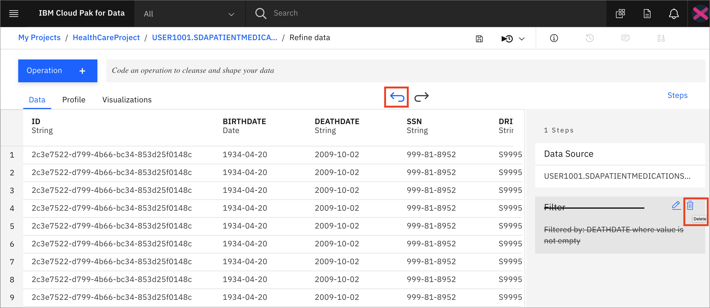

* We can perform other filters. Click on the `+Operation` button again, and this time select `Filter` and then select *`TOTALCOST`* from the *Column* drop down list and *`Is greater than`* from the *Operator* drop down list, and finally enter `2000` under *Value* and Click the `Apply` button.

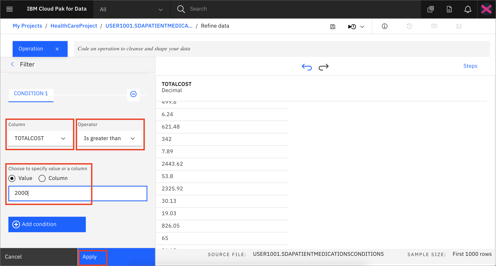

* Remove the filter using one of the methods described above.

* Let's say we've decide that there are columns that we don't want to leave in our dataset ( maybe because they might not be usefule features in our Machine Learning model, or because we don't want to make those data attributes accessible to others, or any other reason). We'll remove the `PREFIX`, `FIRST`, `LAST`, `SUFFIX`, and `MAIDEN` columns.

* For each columnn to be removed: Click the `+Operation` button, then select the `Remove` operation. Click the `Change column selection` option, choose the desired column to remove (i.e. `PREFIX`), click `Next` and click `Apply`.

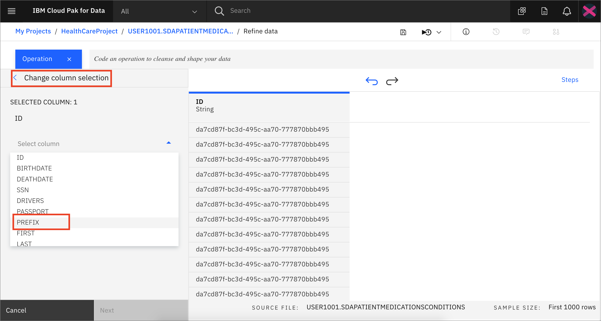

* The columns will be removed. Repeat for each of the above columns.

* At this point, you have a data transformation flow with 5 steps. As we saw in the last section, we keep track of each of the steps and we can even undo (or redo) an action using the circular arrows. To see the steps in the data flow that you have performed, click the *Steps* button. The operations that you have performed on the data will be shown.

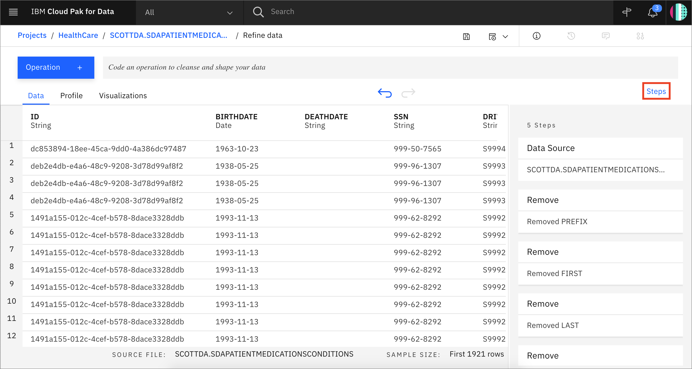

* You can modify these steps in real time and save for future use.

### Schedule Jobs

Data Refinery allows you to run jobs at scheduled times, and save the output. In this way, you can regularly refine new data as it is updated.

* Click on the "jobs" icon and then `Save and create job` option from the menu.

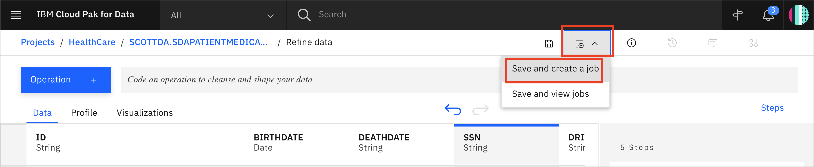

* Give the job a name and optional description. Note that you can `Edit` the steps in this Data Refinery flow at this time. Also, note the output name, which in this case is * USER1001.SDAPATIENTMEDICATIONSCONDITIONS_shaped.csv* . Click the `Create and Run` button.

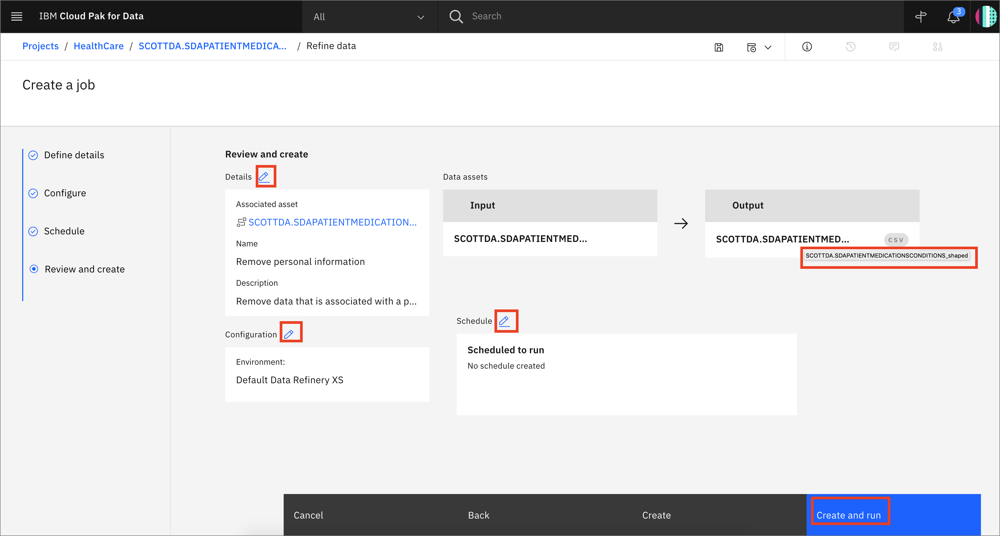

* The job will be listed as *Status* *`Running`* and then the *Status* will change to *`Completed`*.

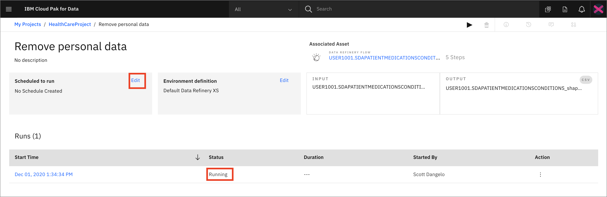

* You can click `Edit` next to *Scheduled to run*. Notice that you can toggle the *Schedule to run* switch and choose a date and time to run this transformation as a job as well as if and how frequently it will repeat. We will not run this as a job, go ahead and click the `Cancel` button

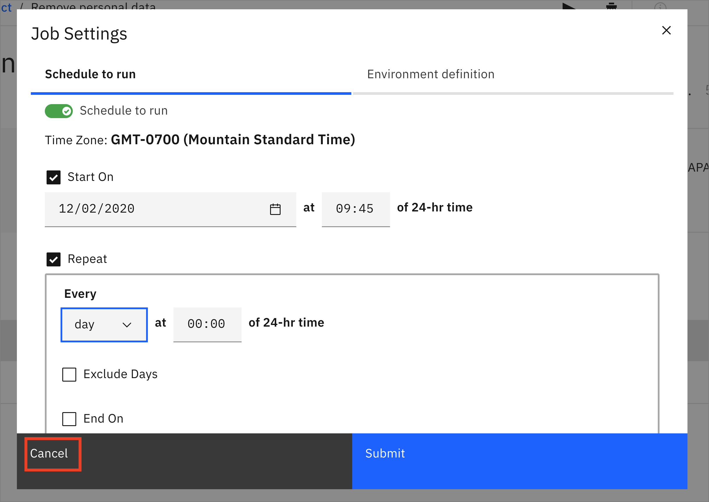

### 3. Profile Data

* Go back to the top level of the data refinery view by clicking on the flow asset under the *'Associated Asset'* section in the scheduled job page.

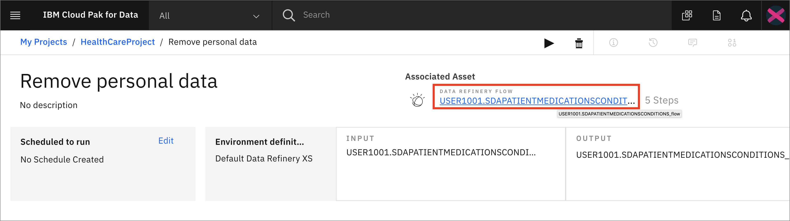

* Clicking on the *Profile* tab will bring up a view of several statistics and histograms for the attributes in your data.

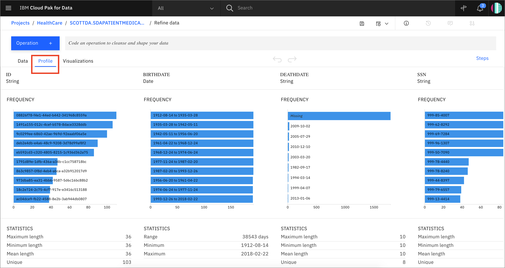

* You can get insight into the data from the views and statistics:

  * The distribution of birthdates is heavily skewed towards older dates.

  * There are over 3x more married people than single people in this dataset.

  * There are over 2x more people of Irish descent than any other ethnicity.

  * Females outnumber males.

### 4. Visualize Data

Let's do some visual exploration of our data using charts and graphs. We can accomplish this in Data Refinery interactively without coding.

* Choose the *Visualizations* tab to bring up an option to choose which columns to visualize. Under *Columns to Visualize* choose *BIRTHDATE*. Click `+Add column` and then *TOTALCOST*, then click the `Visualize data` button.

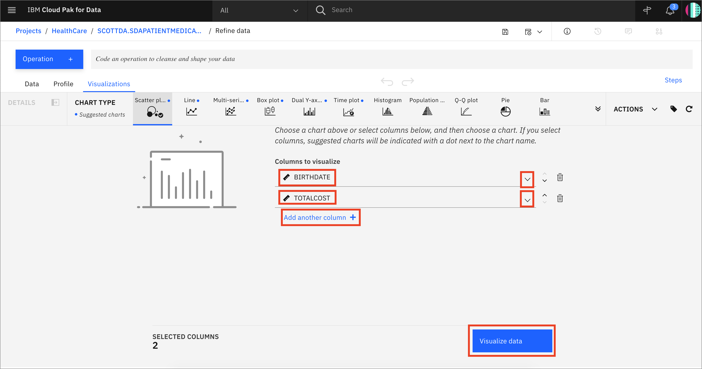

* We first see that the select chart is a Scatter plot. There is some clustering of higher total costs on the left side of the graph, indicating higher total costs for older people, as expected. Hovering over the outlier on the y-axis shows an individual born 1934-04-20 that had total costs of 1,583,003 , a real outlier. We may wish to remove this individual from the dataset during the feature engineering phase of building a machine learning model, as it is likely to skew the results.


* Move the slider at the bottom of the Scatter plot to the right a bit to scroll past that one outlier individual and we can see a more even distribution, with another individual born 1945-01-02 that has TOTALCOST of 202,617, which is similar to others in the distribution.

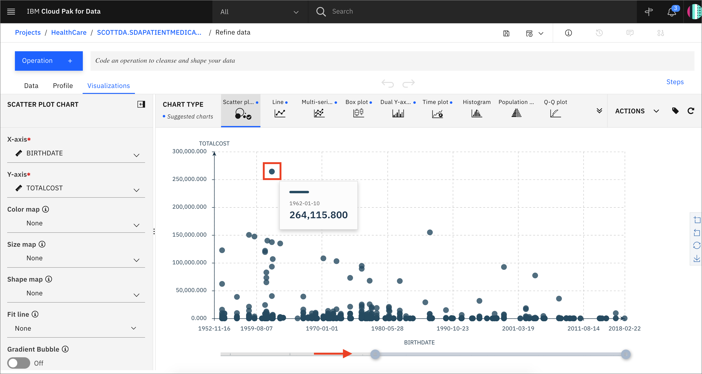

* Also note that we can add items like *Primary title*, *Subtitle*, and *Footnote*.

* Under the `Actions` panel, notice that you can perform tasks such as *Start over*, *Download chart details*, *Download chart image*, or set *Global visualization preferences* (_Note: Hover over the icons to see the names_).

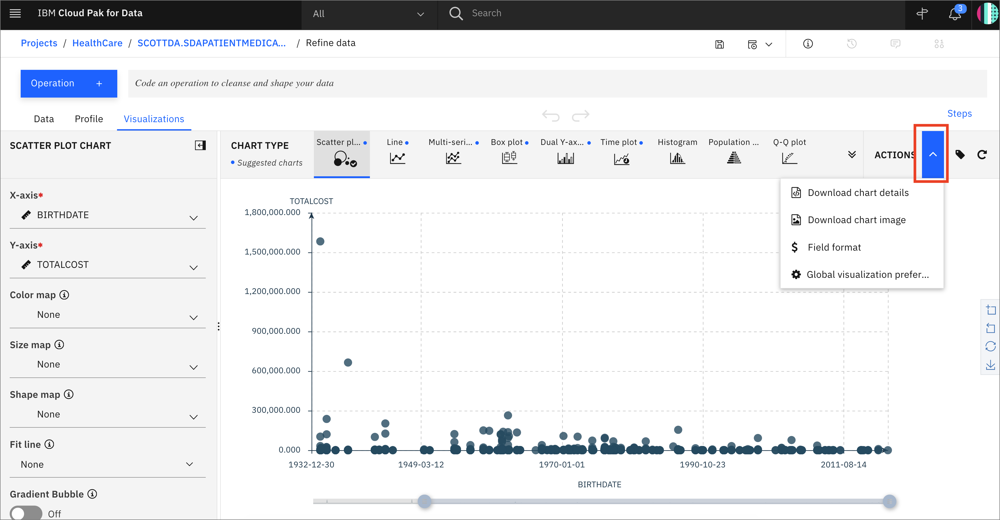

* Click on the "gear" icon in the `Actions` panel. We see that we can do things in the *Global visualization preferences* for *Titles*, *Tools*, *Theme*, and *Notifications*. Click on the `Theme` tab and update the color scheme to *Dark*. Then click the `Apply` button, now the colors for all of our charts will reflect this. Play around with various Themes and find one that you like.

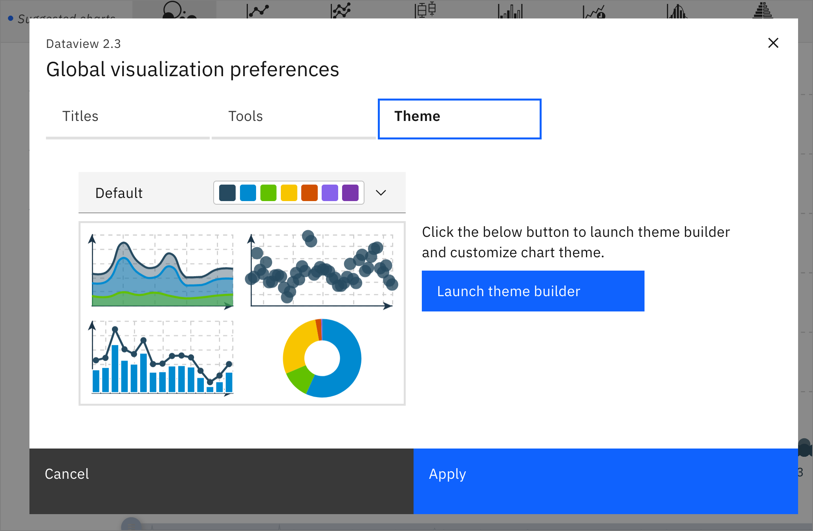

### Conclusion

We've seen a small sampling of the power of Data Refinery on IBM Cloud Pak for Data. We saw how we can transform data using R code, at the command line, or using various Operations on the columns such as changing the data type, removing empty rows, or deleting the column altogether. We next saw that all the steps in our Data Flow are recorded, so we can remove steps, repeat them, or edit an individual step. We were able to quickly profiile the data, so see histograms and statistics for each column. And finally we created more in-depth Visualizations, creating a scatter plot mapping BIRTHDATE vs. TOTALCOST.
