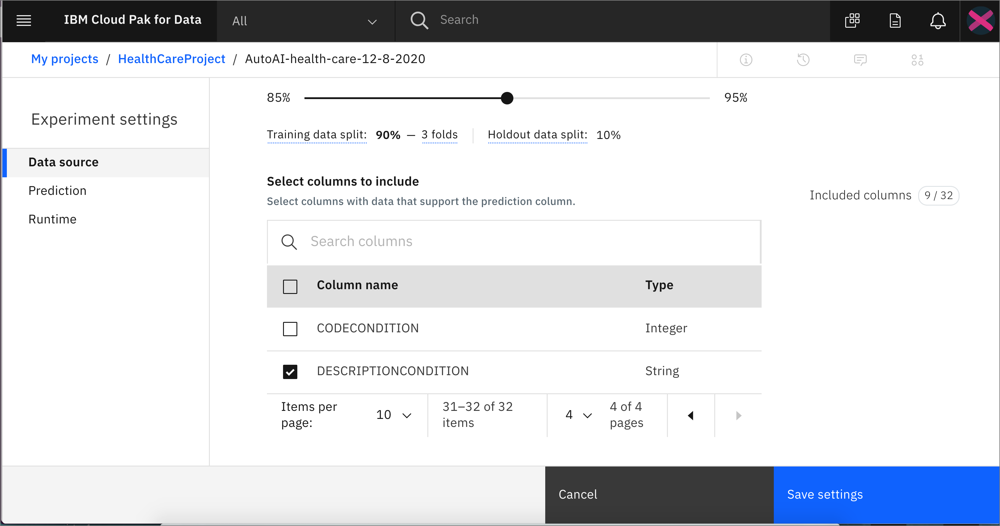
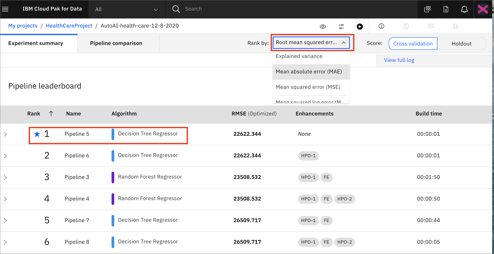

# Automate model building with AutoAI

For this part of the workshop, we'll learn how to use [AutoAI](https://www.ibm.com/support/producthub/icpdata/docs/content/SSQNUZ_current/wsj/analyze-data/autoai-overview.html).
AutoAI is a capability that automates various tasks to ease the workflow for data scientists that are creating machine learning models. It automates steps such as preparing your data for modeling, chooses the best algorithm/estimator for your problem, experiments with pipelines and parameters for the trained models.

We will use the features of AutoAi to perform an experiment based on the following hypothesis:

```
The TOTALCOST of medications prescribed for a patient is correlated with various features. These features include the following from our data set: *MARITAL,RACE,ETHNICITY,BIRTHPLACE,CITY,STATE,REASONDESCRIPTION,DESCRIPTIONCONDITION*
```
The user persona involved is the Data Scientist. We'll use data from our project in `.csv` format and then create and configure an AutoAI experiment. If we get a result we like, we can save the model and them promote to our deployment space to be deployed later for consumption via a REST API:


This section is broken up into the following steps:

- [Automate model building with AutoAI](#automate-model-building-with-autoai)
  - [1. Run AutoAI Experiment](#1-run-autoai-experiment)
  - [2. Examine the results](#2-examine-the-results)
  - [3. Save the model](#3-save-the-model)
  - [4. Promote the model](#4-promote-the-model)
  - [Conclusion](#conclusion)

> **Note:** The lab instructions below assume you have completed the pre-work section already, if not, be sure to complete the pre-work first to create a project and a deployment space.

## 1. Run AutoAI Experiment

* Go the (☰) menu and click *Projects* -> *All projects* and then click on the analytics project that you created in the [pre-work section](../pre-work/README.md).


* To start the AutoAI experiment, click the `Add to project +` button from the top of the page and select the `AutoAI experiment` option.


* Name your AutoAI experiment asset and give an optional description, then click the `Create` button.


* To configure the experiment, we must first give it the dataset that will be used to train the machine learning model. We will be using one of the CSV file datasets we have preloaded into the project. Click on the `Select from project` option.


* In the dialog, select the `PATIENTMEDICATIONSCONDITIONS.csv` file and click the `Select asset` button.


* Once the dataset is loaded, we will need to indicate what we want the model to predict. Under `What do you want to predict?` panel, select the `Prediction column` as `TOTALCOST`. Note that you will use the "gear icon" on the *Experimental settings* button in the next step.


AutoAI will set up default values for the experiment based on the dataset and the column selected for the prediction. This includes the type of model to build, the metrics to optimize against, the test/train split, etc. Let's make some changes for this experiment.

* Select the "gear icon" on the *Experimental settings* button. Under the *Data source* tab on the left toggle the *Subsample rows*. Our data set has 100K rows, so we can start our experiment with a subset of that to speed up the training. The radio button should be on the default *Percent*. Use the up/down arrows to change to *10*. 


* Scroll down to *Select columns to include*. We will uncheck most of these, since for this experiment we don't believe most of the features will be useful. If you performed the [data-visualization-and-refinery](../data-visualization-and-refinery) module, you had a chance to see what the data looked like for each feature (column). Feel free to explore the data to see why we are choosing to include or exclude various feartures. Meanwhile, make sure to uncheck all features except the following: *MARITAL,RACE,ETHNICITY,BIRTHPLACE,CITY,STATE,REASONDESCRIPTION,DESCRIPTIONCONDITION*. Make sure that it looks like the following screenshots.




* Next click the *Prediction* tab on the left, under *Experimental settings*. You will see that the AutoAI tool has already selected *Regression* for the prediction type, which makes sense since we are looking at *TOTALCOST*, a continuous numeric feature. Scroll down to see that you can choose which *Algorithms to test* and how many top *Algorithms to use*. We can leave these unchanged.

* Click on the *Runtime* tab and examine the settings. We will not change these.

* Click *Save settings*. Finally, click *Run experiment*.


* The AutoAI experiment will now run. AutoAI will run through steps to prepare the dataset, split the dataset into training / evaluation groups and then find the best performing algorithms / estimators for the type of model. It will then build the following series of candidate pipelines for each of the top N performing algorithms (where N is a number chosen in the configuration which defaults to 2):

  * Baseline model (Pipeline 1)
  * Hyperparameter optimization (Pipeline 2)
  * Automated feature engineering (Pipeline 3)
  * Hyperparameter optimization on top of engineered features (Pipeline 4)

* The UI will show progress as different algorithms/evaluators are selected and as different pipelines are created and evaluated. You can view the performance of the pipelines that have completed by expanding each pipeline section in the leaderboard.


* The experiment can take several minutes to complete. Upon completion you will see a message that the pipelines have been created. Do not proceed to the next section until the experiment completes.

## 2. Examine the results

* Once the experiment completes, you can explore the various pipelines and options in the UI. Hover over one of the pipelines in the *Relationship map* to see the *Feature Transformers* and *Top algorithms* used, as well as other details. You can *View full log* and/or change the *Rank by:* order.


* Click on the *Pipeline comparison* tab to see each pipeline and the associated metrics. Highlight a pipeline for details.


* Scroll down to see the `Pipeline leaderboard`. Note that you can rank by various metrics, i.e. *Root mean squared error*. 



* The next step is to select the model that gives the best result and view its performance. In this case, Pipeline 8 gave the best result for our experiment. Your run of AutoAI might yeild different results. You can view the detailed results by clicking the corresponding pipeline name from the leaderboard.

* The model evaluation page will show metrics for the experiment, confusion matrix, feature transformations that were performed (if any), which features contribute to the model, and more details of the pipeline. Optionally, feel free to click through these views of the pipeline details.


* Look at the *Feature Transformations* tab to see "new features created during pipeline building, along with the transformation function(s) and the original feature(s) transformed."


* The *Feature Importance* tab will give the relative weights of the various features in determing the prediction that the model makes. Note that some of the features may be a result of Feature Transformation.


What are the results of this experiment? The conclusion I take from this experiment is: 

```
There is not a good correlation between the chosen features (MARITAL,RACE,ETHNICITY,BIRTHPLACE,CITY,STATE,REASONDESCRIPTION,DESCRIPTIONCONDITION) and the label we are trying to predict (TOTALCOST).
```

The Root Mean Squared Error in the case of our example is *92,410.338*, which is *Terrible* ! So, is this experiment a failure?
No, it is not a failure as an experiment. Using AutoAi we were able to quickly test a hypothesis and determine that the hypothesis was incorrect. In that sense, this experiment is not a failure. But, we failed to produce a useful Machine Learning model that would enable us to make a good prediction.

We could use AutoAI to create further experiments, in the hopes of proving a valid hypothesis and creating a useful machine learning model. Let's have a look at the steps we might take if we had actually created a satisfactory model, and wished to save and deploy that model for use in an application.

* Close the pipeline details window by clicking on the `X` in the upper-right corner.

## 3. Save the model

* In order to deploy this model, click on the `Save as` button next to the pipeline you have chosen to save.


* Choose *Model* if you want to Create a Watson Machine Learning model asset that you can test with new data, deploy to generate predictions, and trace lineage activity. Choose *Notebook* if you wish to create a notebook if you want to view the code that created this model pipeline or interact with with the model programatically. Give an optional description and optional tags.


* Click `Create`. You will receive a notification to indicate that your model is saved to your project. View the model details by clicking *View in project* or go back to your project main page by clicking on the project name on the navigator on the top left, and then click the saved model in the `Models` section of the `Assets` page.


## 4. Promote the model

*  In order to deploy the model and utilize a REST endpoint for scoring, click on the `Promote to deployment space`:


* Select the deployment space that was created as part of the pre-work as the `Target space`. Add an optional Description or Tags and click `Promote`.


> ***Note***: This is assuming you have already created a deployment space in the `pre-work` section of the workshop. 

* You will see a notification that the model was promoted to the deployment space succesfully.


Using this process, you can deploy a model created in AutoAI for use via a REST endpoint.

## Conclusion

In this module we saw how we can use an AutoAI to test a hypothesis regarding the features and proposed label of a data set. Without spending much time we were able to determine that the hypothesis was not valid, and thus allowed the most efficient use of time for further experiments. The AutoAi framework automatically performed several tasks:

* Data Wrangling
* Algorithm Evaluation & Selection
* Feature Engineering
* Hyperparameter Optimization

In the case where we are satisfied with the results of the experiment, we saw how to save the model and deploy it to the Watson Machine Learning service for scoring of novel data.
The choice to save the model as a Jupyter notebook also allows further exploration and manipulation of the various algorithms, pipelines, and hyperparameters.
